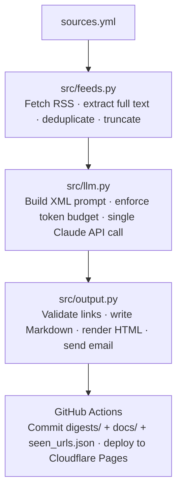

# AI Digest

A daily AI/developer news digest, automatically generated and published each morning.

**Live site:** https://ai-digest-elw.pages.dev

---

## What it does

Runs every day at 03:00 UTC via GitHub Actions:

1. Fetches RSS feeds from configured sources
2. Filters out articles older than 14 days and URLs already seen in the past 14 days
3. Extracts full article text where the feed summary is too short (via Trafilatura)
4. Passes all articles to Claude (Sonnet 4.6) in a single API call
5. Publishes the digest as:
   - A dated Markdown file in `digests/` (permanent archive)
   - `docs/index.html` — latest digest, deployed to Cloudflare Pages
   - `docs/archive.html` — index of all past digests
   - An HTML email to the digest inbox

## Architecture



**Key design constraint:** all articles are sent to Claude in one API call — no chunking, no streaming — to preserve coherence and take advantage of prompt caching.

## Tech stack

- **Python** — pipeline, feed parsing, HTML rendering
- **Claude API (Sonnet 4.6)** — summarisation and editorial curation
- **Trafilatura** — full-text extraction from article URLs
- **GitHub Actions** — daily scheduling, git commit, Cloudflare deployment
- **Cloudflare Pages** — static site hosting

## Sources

Configured in `sources.yml`:

- Hacker News (AI/LLM posts, 50+ points)
- Simon Willison's blog
- The Rundown AI
- Swyx
- Anthropic Blog
- r/LocalLLaMA
- r/ClaudeAI

## Digest sections

- **TL;DR** — two to three sentences for a quick phone scan
- **General AI Developments** — models, research, industry news
- **Engineering & AI Workflows** — how teams are using AI day-to-day
- **Tool Updates** — Claude, Claude Code, Cursor, Copilot, etc.
- **GitHub Trending** — trending repos tagged [AI] or [Other]
- **Try This** — one concrete thing to experiment with this week

## Manual run

```
gh workflow run digest.yml --repo AidanC589/ai-digest
```

## Configuration

Key constants in `src/config.py`:

| Constant | Default | Purpose |
|---|---|---|
| `MAX_FEED_ITEMS` | 5 | Articles fetched per feed |
| `MAX_ARTICLE_AGE_DAYS` | 14 | Filters out older articles |
| `MAX_WORDS_PER_ARTICLE` | 600 | Text cap per article before API call |
| `TOKEN_BUDGET` | 35,000 | Input token cap — trims content if exceeded |
| `MODEL` | claude-sonnet-4-6 | Anthropic model used |

## Secrets required

Set in GitHub Actions secrets:

| Secret | Purpose |
|---|---|
| `ANTHROPIC_API_KEY` | Claude API access |
| `CF_API_TOKEN` | Cloudflare Pages deployment |
| `CF_ACCOUNT_ID` | Cloudflare account |
| `GMAIL_USER` | Gmail address to send/receive the digest |
| `GMAIL_APP_PASSWORD` | Gmail App Password for SMTP auth |

## Cost

Approximately $0.05–0.10 per run (~$20–35/year) at current token volumes.
